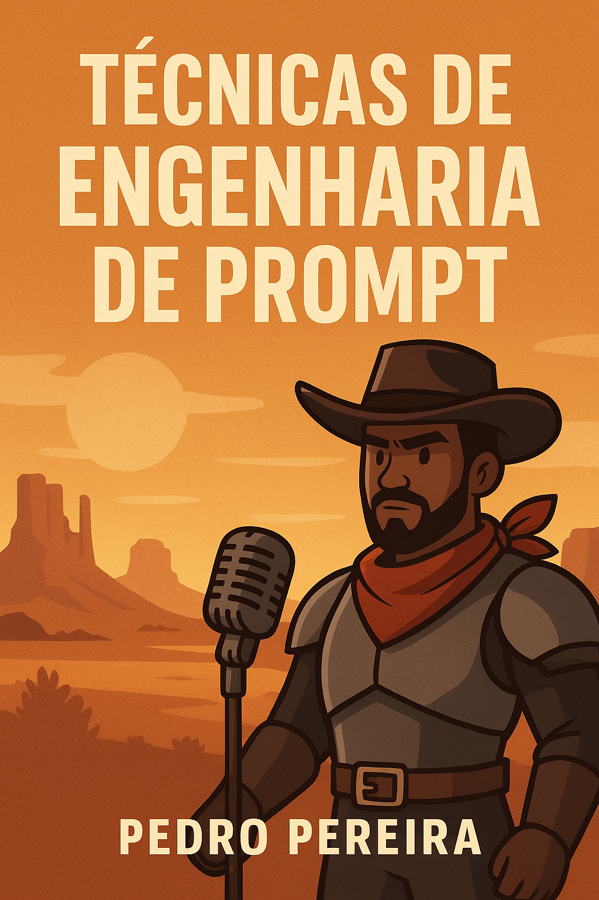

# 📘 Ebook: Técnicas de Engenharia de Prompt

  

<!-- Substitua o nome acima pelo arquivo exato da sua capa, por exemplo: "A_flat_digital_illustration_serves_as_the_cover_de.png" -->

## 📑 Sumário
1. [💡 Sobre o projeto](#-sobre-o-projeto)  
2. [🧭 Conteúdo do Ebook](#-conteúdo-do-ebook)  
3. [⚙️ Ferramentas utilizadas](#️-ferramentas-utilizadas)  
4. [🧾 Histórico Organizado de Prompts](#-histórico-organizado-de-prompts--ebook-engenharia-de-prompt)  
5. [👨‍💻 Autor](#-autor)  
6. [🔗 Acesse o Ebook](#-acesse-o-ebook)  
7. [🧠 Frase de encerramento](#-frase-de-encerramento)

---

## 💡 Sobre o projeto
Este projeto foi desenvolvido durante o **Bootcamp de Fundamentos de Inteligência Artificial da DIO**.  
O objetivo foi criar um **ebook interativo e visual**, explorando o universo da **Engenharia de Prompt** — a arte de comunicar ideias de forma precisa para que a IA entregue resultados poderosos e criativos.

O ebook apresenta os principais conceitos, técnicas e exemplos práticos sobre como estruturar prompts eficazes para gerar textos, imagens, códigos e muito mais.  
Cada capítulo foi pensado para ensinar de forma simples e envolvente como transformar comandos em resultados inteligentes.

---

## 🧭 Conteúdo do Ebook

### **Capítulo 1 — Dominando a Arte da Engenharia de Prompt**
Explica o que é a Engenharia de Prompt e como ela se tornou o novo “alfabeto digital” da era da IA.  
Mostra como traduzir ideias humanas em instruções claras e contextuais que guiam modelos de linguagem.

### **Capítulo 2 — Principais Técnicas de Engenharia de Prompt**
Apresenta as principais técnicas com exemplos práticos:
- **Formatting Prompting** — definir o formato da resposta.  
- **Role Prompting** — atribuir papéis e tons de voz à IA.  
- **Chain-of-Thought** — pedir raciocínio passo a passo.  
- **Context Expansion** — enriquecer o contexto para mais precisão.  
- **Iterative Prompting** — refinar respostas por iteração.  
- **Few-Shot Prompting** — ensinar com exemplos.  
- **Style and Tone Control** — controlar estilo e emoção.  
- **Negative Prompting** — definir o que evitar.

### **Capítulo 3 — Combinando Técnicas e Dominando a IA**
Explora como misturar técnicas em prompts compostos, modulando contexto, tarefa, estilo e restrições para atingir resultados consistentes e criativos.  
Enfatiza que a verdadeira maestria está em **pensar estrategicamente** e transformar a IA em uma extensão da mente criativa.

### **Conclusão**
O ebook encerra com uma reflexão sobre o papel humano na era das inteligências artificiais — lembrando que um bom prompt não é sorte, é **estratégia e arte**.  
> “O segredo não está em falar com a IA. O segredo está em fazer a IA pensar como você.”

---

## ⚙️ Ferramentas utilizadas
- **ChatGPT** — para estruturação, roteiro e revisão do conteúdo.  
- **Gemini** — para apoio na criação textual.  
- **PowerPoint** — para o design visual e diagramação do ebook.

---

## 🧾 Histórico Organizado de Prompts – Ebook “Engenharia de Prompt”

### 🟤 **1. Criação do título**

**🧠 Seu prompt:**
> Crie um titulo de ebook sobre técnicas de engenharia de prompt, o ebook é do nicho de IA's, e tem como subnicho Engenharia de Prompt, o titulo deve ser curto, com temática inspirada no jogo Red Dead Redemption, liste várias variações

**📘 Resposta:**
- Código da Redenção  
- Prompt do Desperado  
- Red AI Redemption  
- Gatilho Mental  
- IA no Pôr do Sol  
- Velho Oeste dos Prompts  
- Forasteiros da IA **<--- (Escolhido)** 
- Redemption Script  
- Trilha Selvagem da IA  
- Pistola de Código  
- Caçador de Respostas  
- Oeste Inteligente  
- Sela de Código  
- Rastro Digital  
- Red Prompt Saga  

---

### 🟤 **2. Estilos de imagem para IA**
**🧠 Seu prompt:**
> Me diga alguns estilos de imagem para geração de uma imagem para IA 

**📘 Resposta:**
- **Realistas:** fotorealismo, cinematic, hiper-realismo.  
- **Ilustrativos:** concept art, pintura digital, HQ/mangá.  
- **Clássicos:** aquarela, óleo sobre tela, surrealismo.  
- **Modernos:** low poly, flat design, cyberpunk, vaporwave.  
- **De animação:** cartoon, chibi, Pixar, isométrico.  
- **Temáticos:** steampunk, sci-fi, fantasia, gótico.  

---

### 🟤 **3. Prompt para Geração da Imagem (GEMINI)**
**🧠 Seu prompt:**
> Crie uma imagem inspirada no jogo Red Dead Redempition. No Estilo Watercolor / Aquarela.
Consegue recriar no tamanho A4 (210mmX297mm).
A pintura tem que estar pela Imagem COMPLETA.
O Personagem precisa ser FIEL ao jogo.
Para a ambientação, pode fazer algo como o encontro da realidade do jogo com a realidade das IA's.

---

### 🟤 **4. Criação do texto do eBook (Capítulo 1)**
**🧠 Seu prompt:**
> Agora faça um texto para o ebook, com foco em Técnicas de Engenharia de Prompt, listando os principais exemplos

**📘 Resposta:**
- Role Prompting  
- Formatting Prompting  
- Chain-of-Thought  
- Context Expansion  
- Iterative Prompting  
- Style and Tone Control  
- Few-Shot Prompting  
- Negative Prompting  

> “A IA não entende intenção, entende contexto.”

---

### 🟤 **5. Continuação (Capítulo 2)**
**🧠 Seu prompt:**
> Continue para o capitulo 2 

**📘 Resposta:**
Capítulo narrativo com analogias de Velho Oeste, misturando técnicas e metáforas cinematográficas.  
> “Quem aprende a guiar as rédeas, atravessa fronteiras que outros nem ousam enxergar.”

---

### 🟤 **6. Conclusão do eBook**
**🧠 Seu prompt:**
> Faça uma conclusão para o Ebook  

**📘 Resposta:**
> “O verdadeiro mestre não é quem sabe todas as respostas, mas quem sabe fazer as perguntas certas.”  
> “Seu próximo prompt pode ser o disparo que muda tudo.”  

---

### 🟤 **7. Frase de despedida**
**🧠 Seu prompt:**
> Faça uma frase de despedida, curta e impactante. 

**📘 Resposta:**
> “Que seus prompts disparem ideias que ninguém possa parar.”

---

## 👨‍💻 Autor
Feito com ❤️ por **Pedro Pereira**  
📍 Projeto desenvolvido com apoio da **DIO – Digital Innovation One**

---

## 🔗 Acesse o Ebook
📄 [Clique aqui para visualizar o ebook completo](./Ebook-Técnicas_de_Eng_de_Prompt.pdf)

---

## 🧠 Frase de encerramento
> “Que seus prompts disparem ideias que ninguém possa parar.” 🚀
